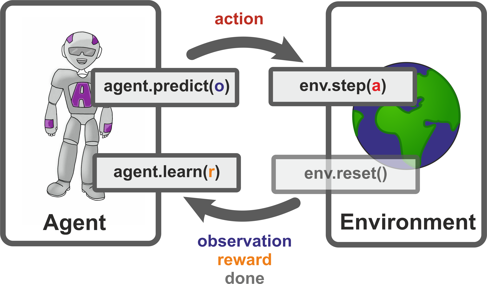

# Tutorial: Reinforcement Learning in Ion Traps

This tutorial teaches you to build your own physics-inspired reinforcement 
learning (RL) environment featuring simulations of a few ions manipulated by 
laser pulses. 

We consider a standardized setting which can be summarized with some pseudo code 
integrated in the standard picture for the RL paradigm:



## Get Started

1.  Build the RL environment interactively in the IPython notebook 
    *Ion Trap Environment*.
2.  Check out how a simple tabular projective simulation agent works under the 
    hood by looking at the fully commented, short code in *ps.py*
3.  Try it out yourself and let an agent learn in your newly built environment
    by following the instructions in the IPython notebook 
    *Reinforcement Learning for Ion Traps*.
4.  Explore what else you can do with this environment when using 
    different agents, maybe even deep RL.
5.  Find more ingenious ways of translating physics problems into RL 
    environments.

## Preliminaries

Before we get to the meat, here is some preliminary information. 
`numpy` and `scipy` are the most important python extensions which we are going 
to rely on in this tutorial. 
Some jupyter notebook extensions are useful. So if you don't have any 
extensions, install them as described 
[here](https://jupyter-contrib-nbextensions.readthedocs.io/en/latest/install.html) 
and [here](https://github.com/Jupyter-contrib/jupyter_nbextensions_configurator):

```bash
pip install --user jupyter_contrib_nbextensions
pip install --user jupyter_nbextensions_configurator
jupyter nbextensions_configurator enable --user
```

This allows you to activate certain packages that may come in handy. 
Specifically for the exercise *Ion Trap Environment* `Collapsible headings` is 
a plus as well as `Freeze`. 
Strictly speaking however you don't need any. They are just for the experience.
